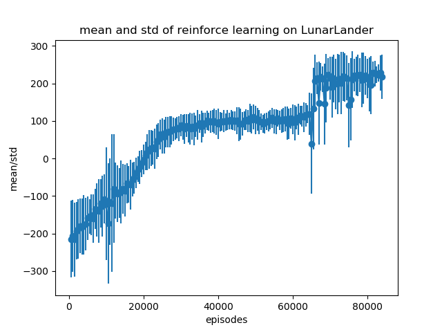
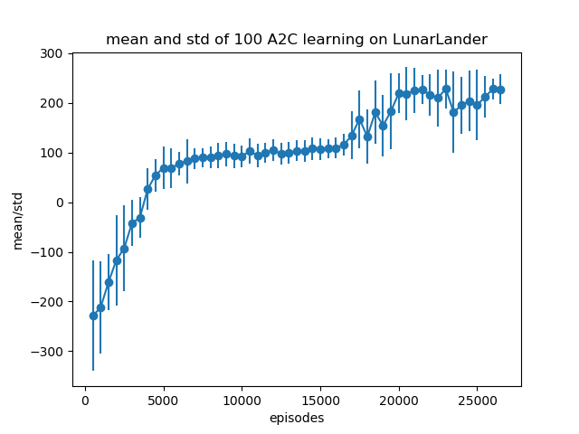
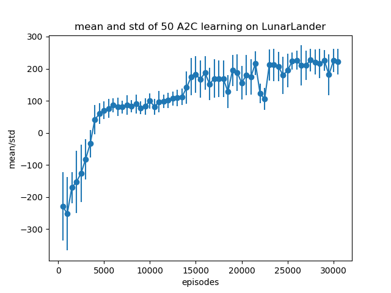

# Reinforcement Learning
The code in this repo solves the LunarLander environment in OpenAI gym by using imitation learning, reinforce learning and a2c. The training results of reinforce and a2c are listed as follows.

    

The figure above shows the mean and std during training using reinforce learning method. It reaches 200 finally which means the environment is solved. But it took relatively long time for training.

  
  

The figures above shows the result of A2C method. We use 100 and 50 steps advantage to update the value network. It performs better than reinforce.
